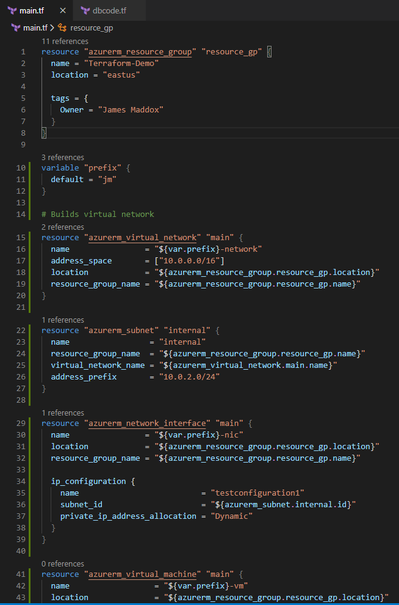
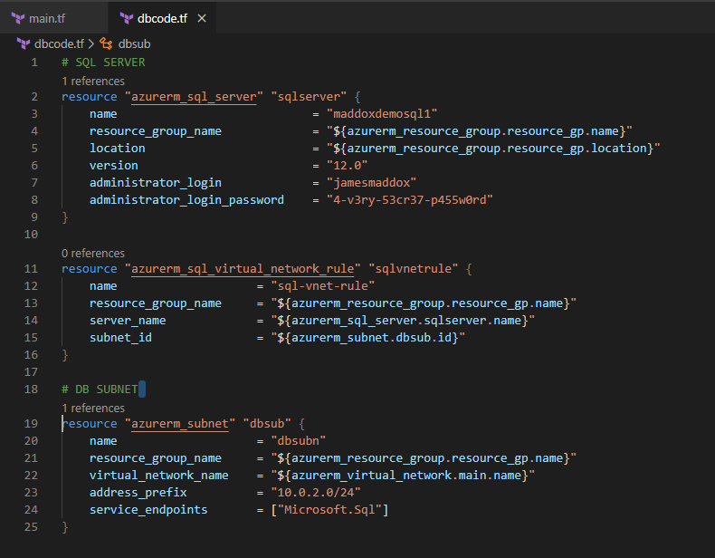
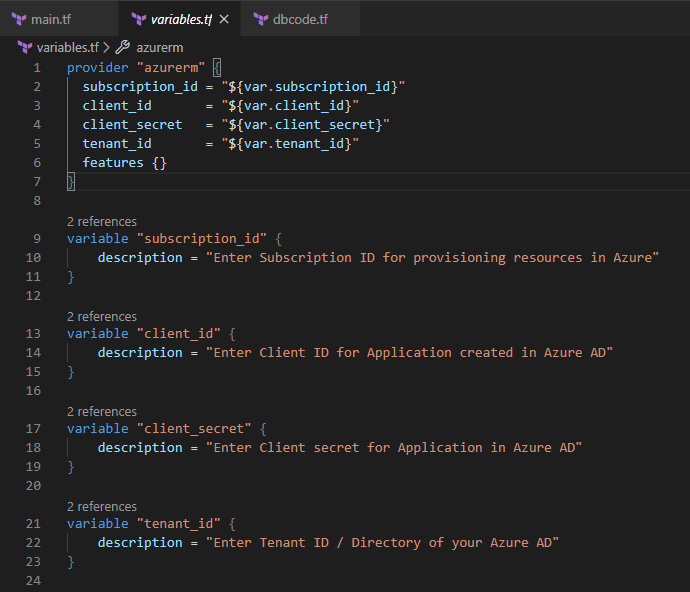
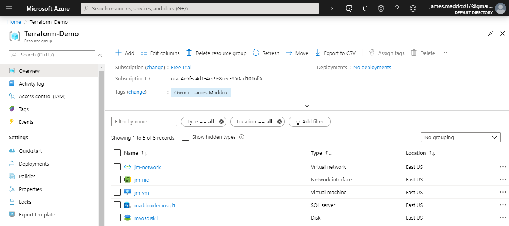
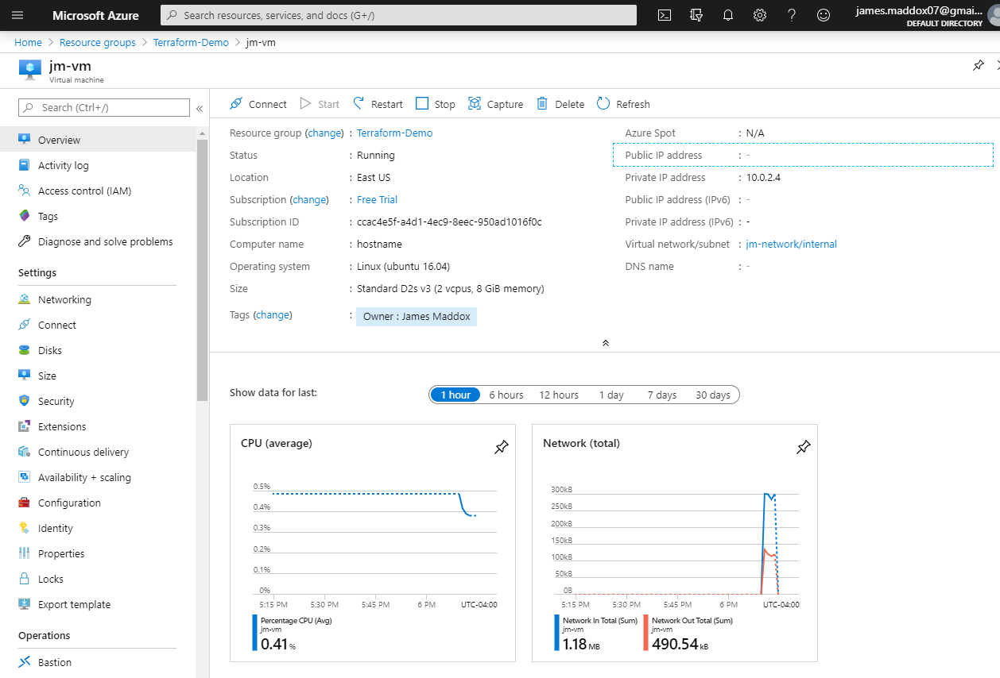
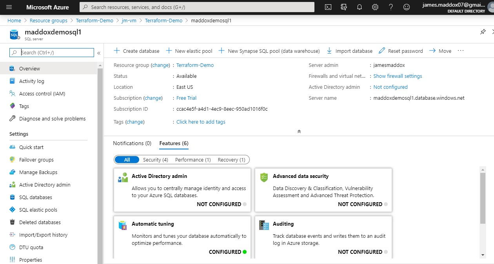

## Terraform Demo in Azure

I used Terraform to create a Linux virtual machine in Azure and deployed a SQL database as well. 

Main TF file:

Database code:

Variables (subscription ID, client ID, etc.):

Visual representation of config:

Resource group showing elements created from Terraform code:

Details on the Linux VM:

Created SQL Database:
