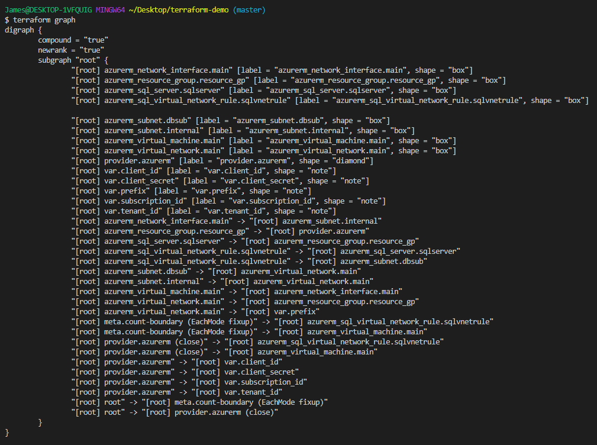

## Terraform Demo in Azure

I used Terraform to create a Linux virtual machine in Azure and deployed a SQL database as well. 

Main TF file:  
  
 
Database code:  
  
 
Variables (subscription ID, client ID, etc.):  
  
 
Visual representation of config:  
  
 
Resource group showing elements created from Terraform code:  
  
 
Details on the Linux VM:  
  
 
Created SQL Database:  
